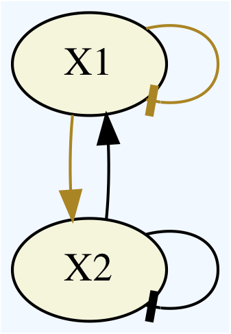

# DSGRN
Dynamic Signatures Generated by Regulatory Networks

[](https://travis-ci.org/shaunharker/DSGRN) [](https://coveralls.io/github/shaunharker/DSGRN?branch=master)[](https://zenodo.org/badge/latestdoi/35697682)

[Documentation](http://dsgrn.readthedocs.io/en/latest/)

Version 1.1.0
Shaun Harker
2018-03-28

## Overview 

This project uses computational dynamics to produce
dynamical surveys of switching models of regulatory 
networks. The resulting data is stored into a database
which can then be queried for further research.

## Installation

To install DSGRN you will need a modern C++ compiler (supporting C++11) and Python 3. If you have these and the dependencies needed by DSGRN (see [Install.md](Install.md)) installed on your system, all you need to do to install DSGRN is to run the following command on the terminal:

	pip install --upgrade --force-reinstall --no-deps --no-cache-dir git+https://github.com/marciogameiro/DSGRN.git

Alternatively, you can clone the GitHub repository and install with:

	git clone https://github.com/marciogameiro/DSGRN.git
	cd DSGRN
	./install.sh

If you don't have all the dependencies installed or if the above fails, see [Installation](Install.md) for some options on how to proceed. Installing DSGRN as above on a Mac usually fails with the C++ compiler and the Python provided by Apple. In that case you need to install new versions as described in the link above.

## Usage

To check if DSGRN is installed do

```python,test
import DSGRN

network = DSGRN.Network("X1 : (~X1)(X2)\n X2 : (X1)(~X2)")
DSGRN.DrawGraph(network)
```

This should plot the network



See the [GettingStarted](https://github.com/marciogameiro/DSGRN/blob/master/Tutorials/GettingStarted.ipynb) jupyter notebook in the `Tutorials` folder for the basic usage of DSGRN.

## Examples and Documentation

See `Tutorials` folder for examples.

Also see the [documentation](https://shaunharker.github.io/DSGRN/).
